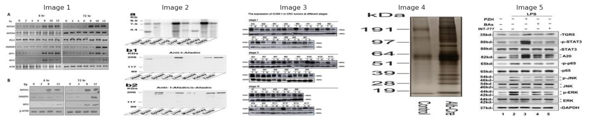
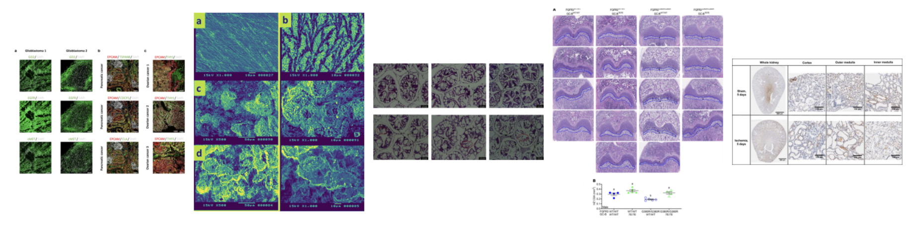
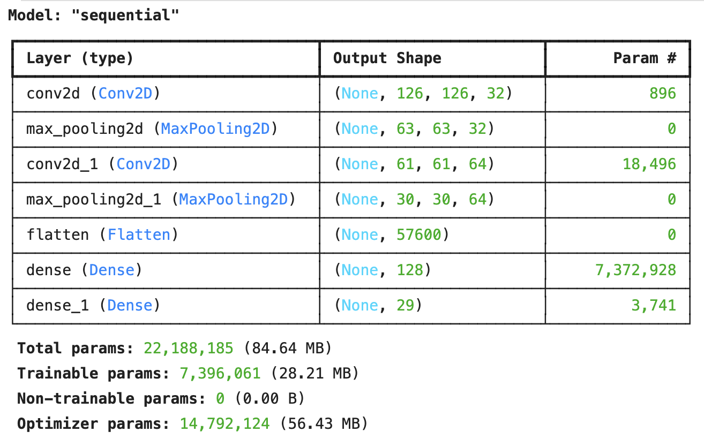
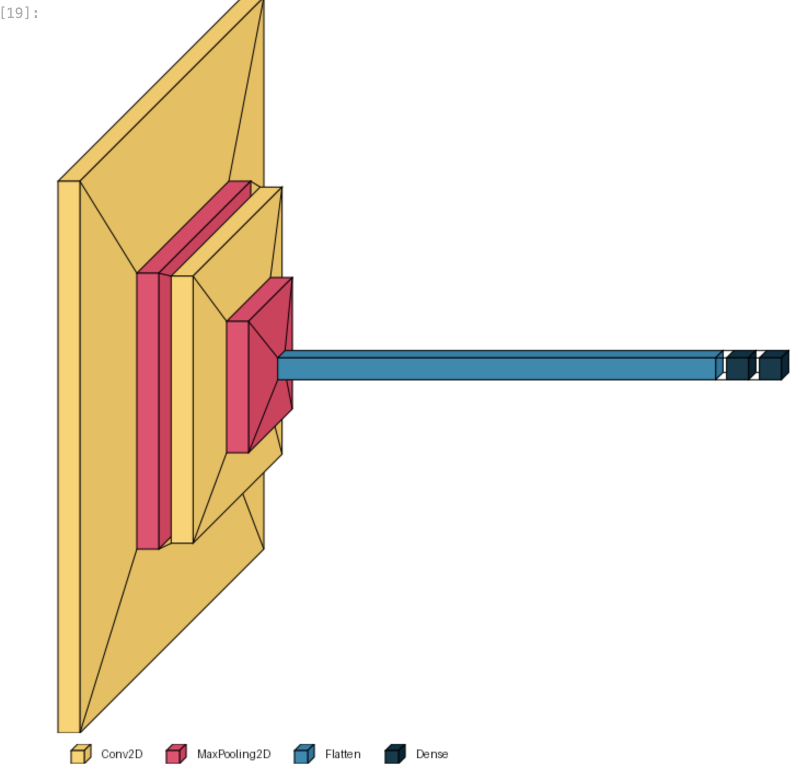
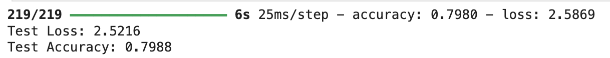
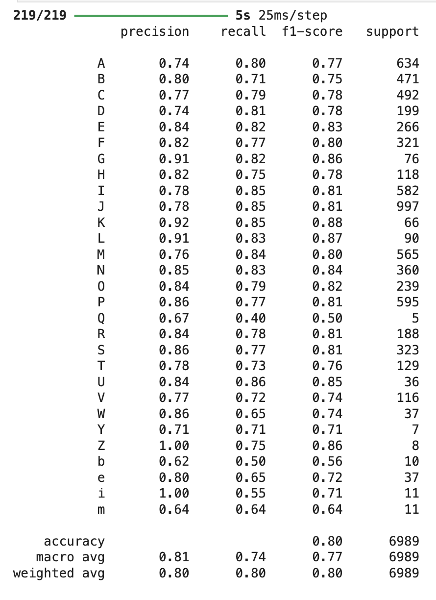
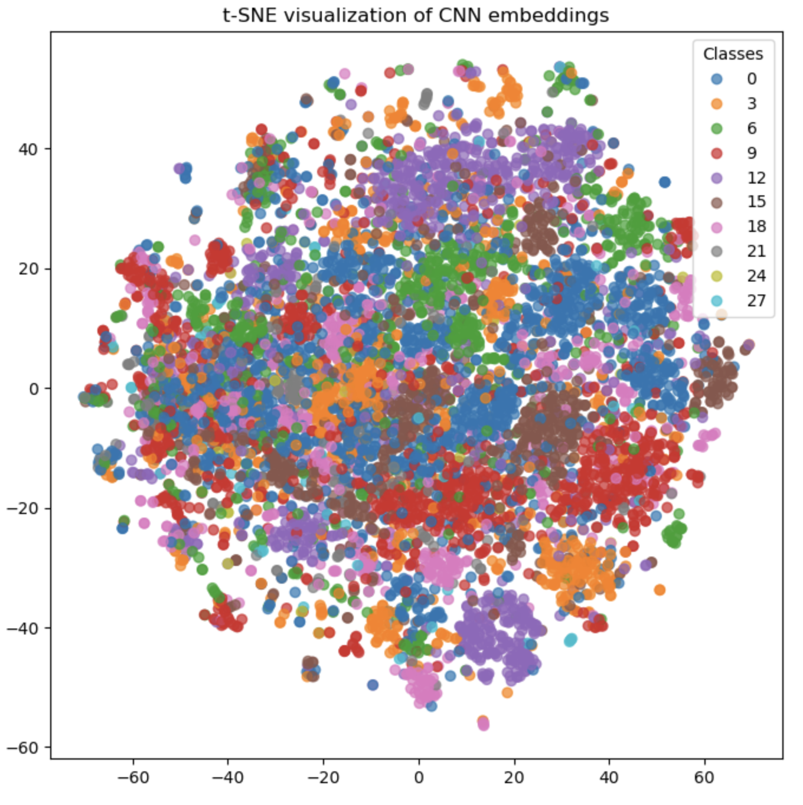

# DSC232R Spring 2025 Group Project Writeup

## **Introduction**	
This project was developed around the BIOMEDICA huggingface database, particularly focusing on the histopathological subset available under the noncommercial license. The BIOMEDICA database is a valuable resource for big data analytics because it provides more than 24 million image-caption pairs and 6 million open-source articles with keyed references to the images; this creates a repository of data which is very well-suited for image detection problems as training and validating. Image recognition models require very large and well-annotated datasets. Suitably, the images in the BIOMEDICA dataset are stored with 27 additional fields, including title, key words, and image metadata. Training and optimizing CNNs requires large datasets and sufficiently rich feature sets for the model to learn connections between relevant inputs, and it is often necessary to employ a distributed data processing system via a remote server in order to handle these massive datasets. The project herein leverages Spark and Pyspark via the San Diego Supercomputer Center, which afforded the project team sufficient remote computing resources to handle the data preprocessing, analysis, and modeling required. 

The model developed is intended to provide insights into not only how CNN model training behaves with highly dimensional academic figure image data, but, more importantly, to allow investigation of underlying patterns in the styles and quality of figures accepted and published by various academic journals. This is of interest to the broader field because a competent medical image classification model can reduce the workload on researchers and provide a more cost efficient solution to understanding trends and potential oversights in the medical research literature. Identifying which fields make extensive use of specific medical imaging, data visualization, and dimensionality techniques empowers researchers to develop insights into opportunities for improvement in the rigor and fidelity of published research; the broader medical community therefore benefits as more research is poured into optimizing CNNs for literature review-focused models.

## **Methods - Environment Setup**
In order to access the SDSC Spark remote resources, this project can be accessed by logging into the SDSC Portal, then creating a new Jupyter Lab session. The end user is free to select their desired resource allocation, but the project team recommends the following configuration specifications: 
- Account: TG-CIS240277 
- Partition: shared 
- Time limit (min): 180 
- Number of cores: 20 
- Memory required per node (GB): 128 
- Singularity Image File Location: ~/esolares/spark_py_latest_jupyter_dsc232r.sif
- Environment Modules to be loaded: singularitypro 
- Working Directory: home 
- Type: JupyterLab
  
Once connected to the remote server, this project can be accessed by following the path /expanse/lustre/projects/uci150/ntorno/group_project. Accessing any .ipynb file in this project will provide the end user with recommended Spark session configuration code, located at the very beginning under Step 0: Environment Setup. Each Step 0 section of the project Jupyter Notebooks initiates the Spark session based on the above Jupyter Lab resource specifications. Please note that, if you choose to make any changes to the Jupyter Lab resources from the recommendations above, you should ensure that your environment setup code matches the specifications of your unique session. Otherwise, the Spark session may be initiated as follows:

```
sc = SparkSession.builder 
.config("spark.driver.memory", "10g") 
.config("spark.executor.memory", "6g") 
.config('spark.executor.instances', 19) 
.getOrCreate()
```

## **Methods - Data Exploration**
The data exploration code is contained in the Milestone 2 notebooks, with the most complete work in the file milestone2_v2.ipynb, which is accessible in the SDSC server as well as on GitHub. Step 1 includes the full process of uploading the raw data from the BIOMEDICA unprocessed .tar files into the remote server, first by reading in the files, then creating Spark dataframes for each file type included in the unpacked dataset: .txt, .json, and .jpg. This section also includes some initial data exploration, such as finding the number of unique entries and schema for each file type in the dataset. Finally, the image, text, and structured data are all written to their own parquet files in the remote server. This process allows for the data to be read in and used more efficiently in subsequent sessions, thus avoiding waste of time and resources. Because the parquet data is already available in the remote directory, please note that it is recommended to simply read Step 1 but skip from running Step 0 to Step 2, as this will be a much more efficient way to access the dataset.

Step 2 begins with loading in each parquet file and exploring the datasets by checking important features like the number of unique entries, schema of the data, columns, unique label counts and examples. Both text and JSON data are loaded using PySpark, then we check for null values, distinct entries, and distribution of specific fields like “article_title,” “image_primary_label,” and “image_secondary_label.” Then, the image data is processed using the PIL library, and example images are plotted to investigate the images available and ensure the data preprocessing has resulted in a viable dataset. These visualizations are created to confirm that the images are readable and properly formatted, to ensure the data is usable. 


Finally, Step 3 compares the processed data from the raw .tar files with the preprocessed data in the parquet files made available in the BIOMEDICA database. Through data exploration congruent with that in Step 2, it is clear that the data contained in the preprocessed files is consistent with the data processed in Step 1 and Step 2, with the distinction that the parquet files have already joined the information for each entry contained across the text, json, and image data into one entry for each. Because the parquet files from the BIOMEDICA database are just as clean, free of missing or corrupted data, and easy to use as those processed from .tar, and because those parquet files allow more efficient access to a larger subset of the data, all subsequent work in this project will be completed on the preprocessed BIOMEDICA parquet data. Please note that the plotted images below are simply five randomly selected images from the dataset; they are not meant to exactly match those above from the .tar processed files.


## **Methods - Preprocessing**

The preprocessing steps used to prepare the dataset for modeling are detailed in the Milestone 3 submission, and the most updated file is the Milestone_3_v5.ipynb notebook. This notebook contains the same Step 1 code to download BIOMEDICA files and save one parquet into the remote directory from Milestone 2; this was necessary because the group’s data was deleted by the SDSC team between the Milestone 2 and Milestone 3 submissions, requiring a complete re-upload of the data before proceeding with modeling. Hence, the parquet file has been restored in the remote directory, and the end user can skip from running Step 0 directly to Step 2 to avoid having to re-download the dataset. The end user is encouraged to note the instructions included in the notebook regarding the file path; if the remote directory the end user is working in does not match the path in the first cell, the code in the second cell can be uncommented for easier access. After loading the parquet file, the most important step in preprocessing the dataset is decoding and resizing the image data. This is performed using the PIL and keras libraries, which iterate through the dataset to extract image bytes, convert them into properly sized arrays, and associate each image with its corresponding journal label. This preprocessing pipeline efficiently takes in the complex dataframe schema and recognizes which part of each entry contains the image and label information, returning a dataframe with the properly formatted image and label information without discarding the rest of the data in each entry. The next critical step is preprocessing the labels into one-hot encodings, which takes in the journal titles and creates a unique vector for each category in the dataset. This is a crucial preprocessing step because training a CNN requires that the label data format matches the output layer’s structure, in order to create a probability distribution across all possible labels in the dataset. The final preprocessing step is simply to scale the image pixel values, which provides more efficient training performance by normalizing the magnitudes of all input features.

## **Methods - Model Building**
This model is a Convolutional Neural Network (CNN) which is created using the TensorFlow Keras module. This was chosen because the Spark MLlib resource does not include native support for CNN models, and the project team felt that a regression model would not reasonably perform well on this image classification task. The input layer is, of course, initialized as the input shape of the training dataset, and the input layer is followed by two convolutional blocks with ReLU activation. The convolutional layers are each followed by a MaxPooling layer to halve the feature map size, which is beneficial for computational efficiency. The layers are then flattened from 3D to a 1D vector, then the subsequent fully-connected dense layer with ReLU activation combines all extracted features. The final dense layer with specifications for the num_classes + softmax generates an output containing a probability for each journal label. This model is compiled with the Adam optimizer and categorical crossentropy loss function, and the model reports test accuracy as the desired metric. After the data is split into an 80/20 train/test split, the model is trained on the training data for 13 epochs, using an 80/20 train/validation split. Below are the model summary and diagram for more clarity.




## **Results**
The model achieved a training accuracy of 96.6% by the final epoch and a testing accuracy of 81%. 


The classification report indicated a weighted average precision of 81%, recall of 81%, and f1-score of 81%; the classification report also revealed a range of performance on different classes in the dataset, with precision scores as low as 71% and as high as 100% across various dataset categories. 


Further, the model performance was visualized by performing dimensionality reduction via t-SNE on model predictions, then plotting the t-SNE of the embeddings. 


## **Discussion**
The CNN model achieved approximately 96% training accuracy and 81% test accuracy; these points together indicate that there is significant room for improvement in the model. First, the model achieved substantially higher training accuracy compared to the testing accuracy, indicating that the model is likely overfitting to the training data. The classification report also reveals disparities in performance in different categories, which supports the understanding that classes which are more highly represented in the training data are likely handled best by the CNN, whereas the CNN is not robust enough to perform well when tested on lower frequency classes, or those which were not present at all in the training data. This can be considered a “fair” or mediocre performance for an initial CNN model; while the model provides significant opportunities for improvement, the model evaluation metrics represent a reasonable baseline performance. Moreover, the t-SNE results revealed that the model embeddings do not produce pure or even reasonably high-fidelity clusters. This is often the case in datasets where there is some degree of overlap between classes, thus complicating the process of reliably predicting class identity. This may have been confounded by the semantic overlap in journal titles; for example, the International Journal of Medical Science and International Journal of Parasitology both share three words in common, and the article_journal field of the dataset also truncated some words, such as changing International to Int and Medical to Med. Hence, the t-SNE output is quite understandable as there is significant overlap in the strings contained in the label field. 
	This discussion of results begets several opportunities for improvement for this model. Beginning with the aforementioned model overfitting issue, it is possible that hyperparameter tuning measures could have improved the model’s performance to some extent; for example, implementing L2 normalization and trying different values of C, or perhaps calculating balanced class weights for regularization instead, could have improved the model’s tendency to overfit to certain classes. The learning rate and batch size could also have been optimized in further hyperparameter tuning, which can both contribute to the mitigation of overfitting as well. Additionally, based on the t-SNE results, it is possible that implementing dimensionality reduction before model training may have improved performance as well; if the various journals were clustered based on similar attributes before training the model, perhaps this could result in fewer but higher-fidelity clusters for the model to predict. Further, the article_journals field did have 3,044 unique values, and performing clustering to reduce the journals into clusters of similar classes may have resulted in a more highly separable label class to train the model on. This may not have conferred substantial improvement to model performance, but it would have been a worthwhile option to pursue nonetheless. Finally, another opportunity to improve the model could have been to leverage transfer learning by implementing a pretrained CNN, such as MobileNetV2, which is a robust but highly efficient model available in the tensorflow.keras module. Of course, MobileNetV2 or any other pretrained model would not have been trained for this particular classification task, but it is possible to retrain a portion of the layers of a pretrained model with the desired training dataset, thus transferring much of the training work already done to create the model while customizing the predictions to suit any given dataset. This option could have also been combined with some of the hyperparameter tuning described above for an even more optimal model performance.

## **Conclusion**
In conclusion, the BIOMEDICA image classification project achieved a modest 81% accuracy by implementing a CNN to predict the journal each histopathological image’s corresponding article belonged to. Ultimately, there are several unfulfilled opportunities for improvement in this model; options such as clustering to improve separability of the label classes, transfer learning with a pretrained model, and hyperparameter tuning all could have contributed to improving the accuracy of the model while minimizing overfitting risks. The reason these steps could not be taken by the deadline stem from severe issues with the SDSC system, which prevented the project team from being able to access the remote Spark distributed computing resources on several occasions throughout the project timeline. This group acknowledges that all teams in the course were impacted by these outages, and, though there is no satisfaction in walking away from an incomplete model development project, this is also a valuable lesson that working with new systems can present unique challenges and learning opportunities. This project was still a valuable exercise in developing skills in Spark and Pyspark data analytics, and the results and discussion sections of this write up also provided the opportunity for the project team to carefully and critically evaluate the shortcomings of the work done before the SDSC issues mounted. Of course, the team unanimously wishes that, under different circumstances, the model optimization could have continued, and that a more accurate and robust model could have been developed by the final deadline. This also forces the understanding that no data science project is ever truly perfect, and, even if the aforementioned opportunities for improvement had been implemented, there would still be further work that could have been done to improve the performance or computational efficiency of that model.

## **Collaboration**
Statement of contributions:
- Nicole Torno: Group leader. Proposed the mission of the group project. Managed the pacing. Led all coding and writeup.
- Alexis Jacques: Group contributor. Contributed to code review and writeup.
- Osvaldo Rivera: Group contributor. Contributed to code review and writeup.
- Kenny Kang: Group contributor. Contributed to code review and writeup.
- Whitney deRoche: Group contributor. Contributed to code review and writeup.

Overall, the team worked together to complete and review all project requirements. Through different but equally important roles, the team collaborated throughout the entire course of the quarter by actively participating in group discussions, reviewing datasets and code files, and providing insightful feedback on written components of the project as well. 
